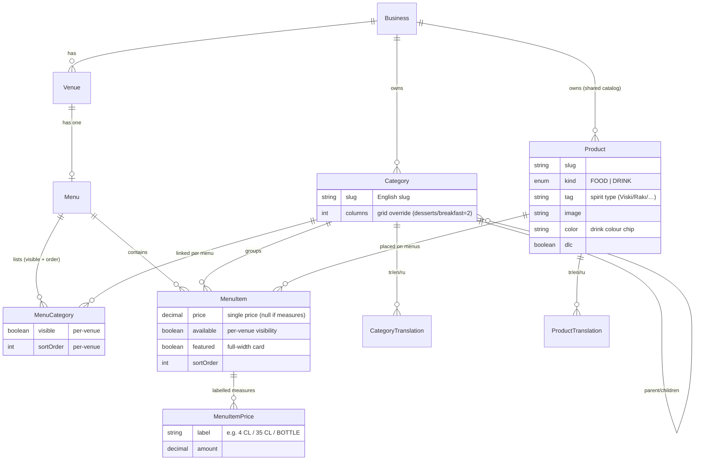
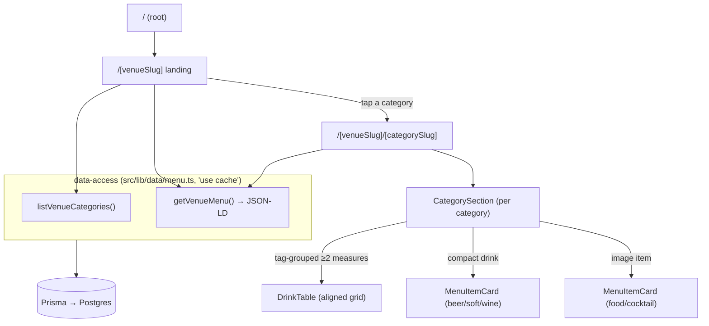
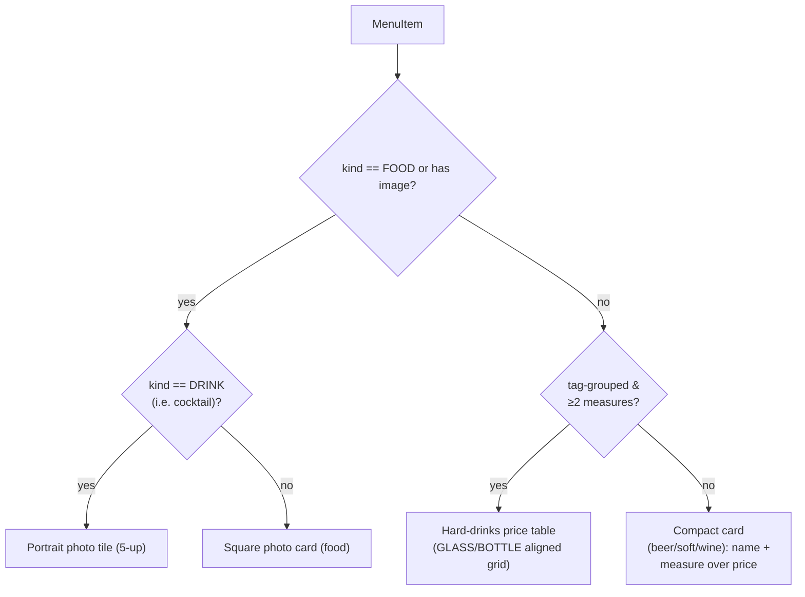
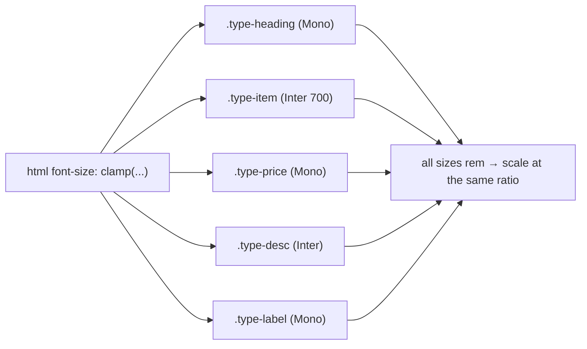

# Diagrams

Visual companions to `ARCHITECTURE.md` and `JOURNEY.md`. These render automatically
on GitHub (Mermaid).

---

## 1. Data model (ERD)

The **Product / MenuItem split** is the core: `Product` holds venue-independent
identity; `MenuItem` holds venue/menu-specific facts (price, availability, order,
category). `MenuCategory` and `MenuItem` are the join rows that make venues *views*
over one shared catalog.

**Why it matters:** adding a venue = new `Venue` + `Menu` + `MenuCategory`/`MenuItem`
rows — **data only, no code branches** (AGENTS rule 10).

---

## 2. Request & render flow

Public reads are Server Components → a thin data-access layer (`use cache`) →
Prisma → Postgres. No client data fetching, no GraphQL.

Unknown slugs render a static shell then a soft-404 (Cache Components pattern).

---

## 3. Card-variant decision (data-driven)

The layout for an item is chosen from **data** — never a category-name string
(AGENTS rule; see `DESIGN.md`).

---

## 4. Typography & responsive standard

One centralized system (`src/app/globals.css`): design tokens + `.type-*` roles,
a **fluid root** (`clamp(13.5px, 11.9px + 0.45vw, 16px)`) so all rem text scales
together, and the rule **TR and EN of one thing share one font**.

Fonts come from legacy `theme.js` (price/cl = Mono, title/desc = Inter); see
`JOURNEY.md` §4.
